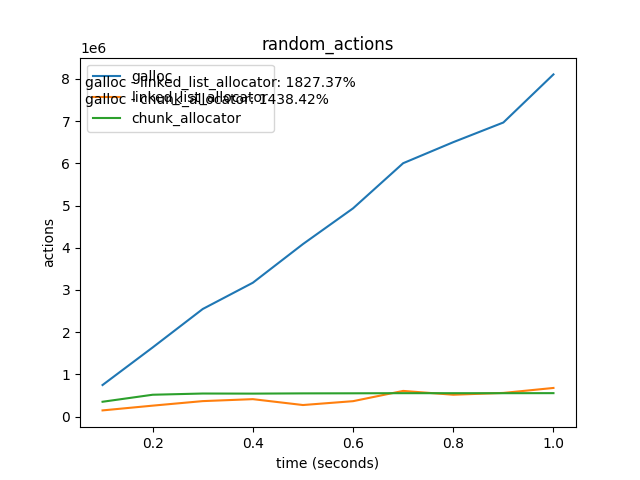
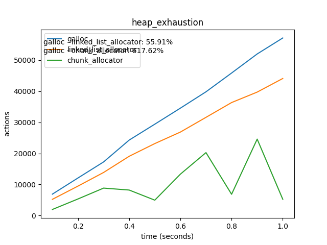

# galloc - `good_memory_allocator`

[](https://crates.io/crates/good_memory_allocator)
[](https://docs.rs/good_memory_allocator)

This is a linked list allocator, inspired by the dlmalloc algorithm, to be used in `no_std` environments such as operating system kernels.
The overhead for each allocation is a single `usize`.
The implementation prioritizes runtime efficiency over memory efficiency, but also provides very good memory utilization.
The allocator is heavily tested with test cases covering almost all code paths; fuzzing is used to cover the rest.

## Usage

Create a static allocator:

```rust
use good_memory_allocator::SpinLockedAllocator;

#[global_allocator]
static ALLOCATOR: SpinLockedAllocator = SpinLockedAllocator::empty();
```

Before using this allocator, you need to initialize it:

```rust
pub fn init_heap() {
    unsafe {
        ALLOCATOR.init(heap_start, heap_size);
    }
}
```

## Features

- **`spin`** (default): Provide a `SpinLockedAllocator` type that implements the `GlobalAlloc` trait by using a spinlock.
- **`allocator`**: Provides an implementation of the unstable `Allocator` trait for the `SpinLockedAllocator` type.

## Performance

In most cases, allocation is `O(1)`, mostly for relatively small allocations with relatively small alignment.
Deallocation is always `O(1)`.
Reallocaiton uses a custom algorithm which tries to prevent copying of memory as much as possible, by reallocating in place.

The overall performance of the allocator is superb, and it performs better than all other alternative allocators which we could find on `crates.io`.

## Benchmarks

We benchmarked `galloc` using multiple benchmarks against 2 other crates that we found on `crates.io`, that seem to provide similar functionality: `simple-chunk-allocator` and `linked-list-allocator`.
In each benchmark, each allocator is given a certain duration and must perform as many operations as it can in the given duration.

#### Random Actions

The first benchmark that we used is called `random_actions`. 
In this benchmark each allocator tries to perform as many allocations, deallocations and reallocations as it can in the given duration.
The size and alignment of the allocations and reallocations is random.
In each iteration, the benchmark randomly chooses between allocation, deallcation and reallocation.



In the top left, below the legend, you can see the percentage difference of the number of actions between galloc and each of the other allocators.
The percentage difference is calculated using the following formula: `a / b * 100`, where `a` is galloc's score, and `b` is the other allocator's score.
You can see that `galloc` outperforms both other allocators by almost an order of magnitude.

#### Heap Exhaustion

The second benchmark that we used is called `heap_exhaustion`. 
In this benchmark each allocator performs as many allocations as it can in the given duration. 
The size and alignment of the allocations is random.
Once an allocation request fails, it means that the heap was exhausted, and the allocator's score is punished by making it sleep for a certain duration.
Thus, this benchmark measures how well the allocator utilizes its memory, since all allocators are given a heap of the same size.



Here, too, `galloc` outperforms the 2 other allocators.

#### Simple Chunk Allocator Benchmarks

The `simple-chunk-allocator` crate provides a benchmark of its own. 
Here is an explanation of the benchmark from `simple-chunk-allocator`'s readme:

> The benchmark performs random allocations of different sizes and alignments and also deallocates some of the older allocations. Over time, the heap becomes full, which is why the number of successful allocations has a higher delta to the attempted allocations.

We ran these benchmarks on the 3 allocators including `galloc`, and the results were as follows:

##### Duration: 1 second
```
RESULTS OF BENCHMARK: Chunk Allocator
     51244 allocations,  15404 successful_allocations,  35840 deallocations
    median=  1210 ticks, average=  1232 ticks, min=   218 ticks, max=144410 ticks

RESULTS OF BENCHMARK: Linked List Allocator
     34937 allocations,  10829 successful_allocations,  24108 deallocations
    median= 28778 ticks, average= 41553 ticks, min=    78 ticks, max=1165606 ticks

RESULTS OF BENCHMARK: Galloc
     51694 allocations,  15651 successful_allocations,  36043 deallocations
    median=   176 ticks, average=   654 ticks, min=    90 ticks, max=989542 ticks
```

##### Duration: 10 seconds
```
RESULTS OF BENCHMARK: Chunk Allocator
     79818 allocations,  23909 successful_allocations,  55909 deallocations
    median=  1294 ticks, average=320782 ticks, min=   174 ticks, max=13773388 ticks

RESULTS OF BENCHMARK: Linked List Allocator
    113181 allocations,  30521 successful_allocations,  79611 deallocations
    median= 91688 ticks, average=120273 ticks, min=    80 ticks, max=1831252 ticks

RESULTS OF BENCHMARK: Galloc
    147720 allocations,  32754 successful_allocations, 103313 deallocations
    median=   214 ticks, average= 39177 ticks, min=    88 ticks, max=2228776 ticks
```

As you can see, `galloc` outperformed both of them in both test cases. This is especially noticable in the 10 seconds test.
